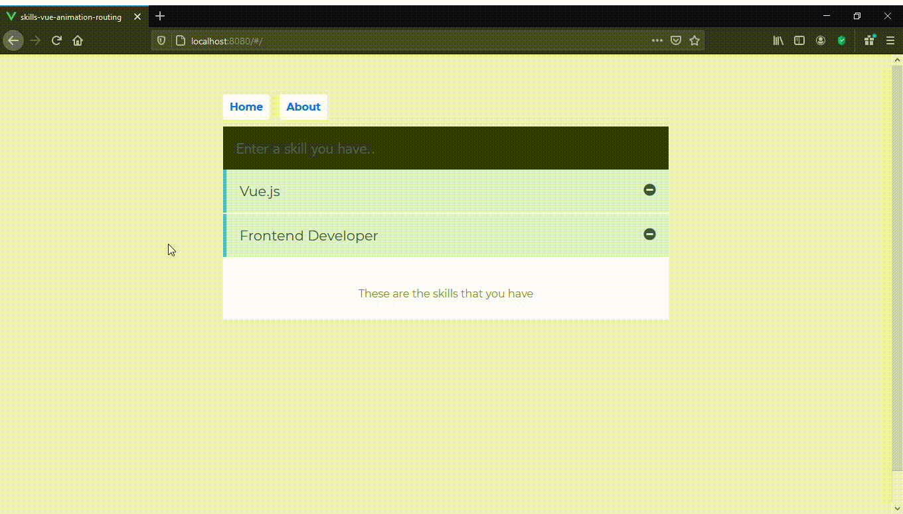

# skills-vue-animation-routing

## Start from scratch
```
npm install -g @vue-cli
cd desktop
vue create skills-vue-animation-routing
package manager : npm
cd project-name
code .
open integrated terminal 
npm install vue-router 
npm run serve
```
## Project setup after clone
```
npm install
```

### Compiles and hot-reloads for development
```
npm run serve
```

### Compiles and minifies for production
```
npm run build
```

### Lints and fixes files
```
npm run lint
```

### Final result 

